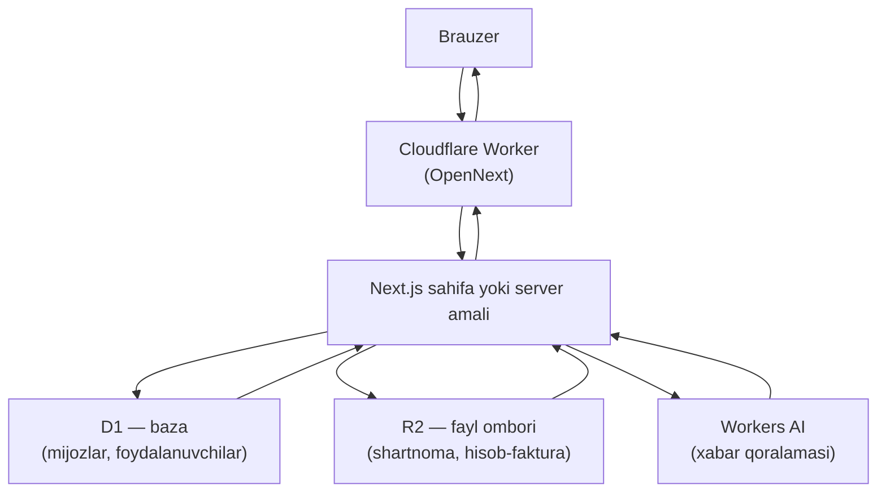

# Loyiha tuzilishi

Bu hujjat qaysi fayl nima uchun kerakligini va so‘rov qanday yo‘l bosishini tushuntiradi. Kod yozishni bilmasangiz ham, oxiridagi jadval orqali kerakli faylni topa olasiz.

## Papkalar bo‘ylab sayr

```
crm-boilerplate/
├── src/                   Ilovaning butun kodi
│   ├── app/               Sahifalar va manzillar
│   │   ├── (marketing)/   Ochilish sahifasi (hamma ko‘radi)
│   │   ├── (auth)/        Kirish va ro‘yxatdan o‘tish
│   │   ├── (app)/         Tizimga kirganlar uchun sahifalar
│   │   ├── api/           Brauzerga sahifa emas, ma’lumot qaytaradigan manzillar
│   │   ├── layout.tsx     Butun ilovaning tashqi qobig‘i: shrift, tema, xabarlar
│   │   ├── globals.css    Ranglar, shrift va umumiy uslub qoidalari
│   │   ├── not-found.tsx  "Sahifa topilmadi" ekrani
│   │   └── icon.svg       Brauzer yorlig‘idagi belgi
│   ├── components/        Umumiy komponentlar
│   │   └── ui/            shadcn/ui komponentlari — qo‘lda tahrirlanmaydi
│   ├── config/            Sozlamalar (hozircha faqat menyu ro‘yxati)
│   ├── features/          Har bir bo‘lim uchun alohida papka
│   │   ├── auth/          Kirish formalari va ularning tekshiruvi
│   │   └── clients/       Mijozlar bo‘limi — yangi modul uchun namuna
│   ├── hooks/             Kichik yordamchi React funksiyalari
│   └── lib/               Baza, kirish, fayllar, sana va AI yordamchilari
│       └── db/            Baza sxemasi va ulanish
├── migrations/            Baza tuzilishini o‘zgartiradigan SQL fayllar
├── scripts/               Terminal buyruqlari (setup, doctor, seed va boshqalar)
├── docs/                  Shu hujjatlar
│   ├── guides/            Qadamma-qadam yo‘riqnomalar
│   └── prompts/           Nusxalab qo‘yiladigan so‘rovlar
├── .agents/skills/        AI agentlari uchun ko‘nikmalar (asosiy nusxa)
├── .claude/skills/        O‘shalarning Claude uchun nusxasi
├── wrangler.jsonc         Cloudflare sozlamalari: baza, fayl ombori, AI
├── package.json           Buyruqlar va paket versiyalari
├── AGENTS.md              AI agentlari uchun loyiha qoidalari
└── CLAUDE.md              Claude uchun qo‘shimcha eslatmalar
```

### `src/app` ichidagi qavslar nimani anglatadi

`(marketing)`, `(auth)`, `(app)` — qavs ichidagi nomlar manzilga qo‘shilmaydi. Ular faqat sahifalarni guruhlash uchun: har bir guruhning o‘z tashqi qobig‘i (layout) bor.

- `(marketing)` → `/` — yuqorida menyu, pastda footer bo‘lgan ochiq sahifa.
- `(auth)` → `/login`, `/signup` — markazga joylashgan bitta ustun.
- `(app)` → `/dashboard`, `/clients`, `/clients/new`, `/clients/[id]`, `/clients/[id]/edit`, `/settings` — chapda menyu. Bu guruhning qobig‘i kirishni tekshiradi.
- `api` → `/api/auth/[...all]` (kirish tizimi) va `/api/files/[id]` (fayl yuklab olish).

`[id]` kvadrat qavsda — bu o‘zgaruvchi qism: `/clients/abc123` manzilida `id` qiymati `abc123` bo‘ladi.

### `src/features` naqshi

Har bir bo‘lim bitta papkada yig‘iladi. `clients` papkasi namuna sifatida saqlanadi — yangi bo‘lim qo‘shganda uni nusxalang:

| Fayl | Nima uchun |
| --- | --- |
| `schema.ts` | Forma tekshiruvi: qaysi maydon majburiy, xato matni qanday |
| `constants.ts` | Doimiy qiymatlar, masalan bosqichlar ro‘yxati |
| `queries.ts` | Bazadan o‘qish funksiyalari |
| `actions.ts` | Bazaga yozish amallari (server tomonida bajariladi) |
| `components/` | Shu bo‘limning jadvali, formasi, yorlig‘i |

## So‘rov qanday yo‘l bosadi



Qadamma-qadam:

1. Brauzer manzilni so‘raydi.
2. So‘rov foydalanuvchiga eng yaqin Cloudflare serveridagi Worker’ga tushadi. OpenNext — Next.js ilovasini shu Worker ichida ishlashga moslaydigan qatlam.
3. Worker mos sahifani yoki server amalini ishga tushiradi.
4. Sahifa kerak bo‘lsa bazaga (`D1`), fayl omboriga (`R2`) yoki AI modeliga (`Workers AI`) murojaat qiladi. Bu uchala ulanish `wrangler.jsonc`da yozilgan: `DB`, `FILES`, `AI`.
5. Tayyor sahifa brauzerga qaytadi.

Muhim nuqta: ilova ma’lumotga faqat ikki eshik orqali boradi — `getEnv()` (`src/lib/cloudflare.ts`) va `getDb()` (`src/lib/db/index.ts`). Har ikkalasi har bir so‘rov uchun yangidan chaqiriladi.

## Kirish qanday tekshiriladi

- Foydalanuvchi kirish formasini yuboradi. Brauzerdagi `authClient` (`src/lib/auth-client.ts`) so‘rovni `/api/auth/…` manziliga yuboradi.
- Better Auth parolni tekshiradi va brauzerga sessiya cookie’sini yozadi.
- `(app)` guruhidagi har qanday sahifa ochilganda `src/app/(app)/layout.tsx` birinchi ish sifatida `requireUser()`ni chaqiradi. U cookie’ni o‘qiydi; sessiya bo‘lmasa, foydalanuvchini `/login` sahifasiga yuboradi.
- Ma’lumotni o‘zgartiradigan **har bir** server amali (`createClient`, `updateClient`, `deleteClient`, fayl amallari, AI qoralamasi) ham alohida `requireUser()` bilan boshlanadi. Sahifa himoyasiga ishonib qolinmaydi.
- `/api/files/[id]` manzili sessiyani o‘zi tekshiradi va kirmagan foydalanuvchiga `{"error":"Avval tizimga kiring"}` javobini `401` kodi bilan qaytaradi. Bu yerda `/login`ga yo‘naltirish ishlamaydi — fayl yuklab olayotgan brauzer uni kuzata olmaydi.
- Bu loyihada `middleware.ts` fayli **yo‘q**. Nima uchun — [DECISIONS.md](DECISIONS.md) D6.

## Nimani o‘zgartirmoqchisiz → qaysi fayl

| Nimani o‘zgartirmoqchisiz | Qaysi fayl |
| --- | --- |
| Ilova nomi va brauzer yorlig‘idagi sarlavha | `src/app/layout.tsx` |
| Ochilish sahifasidagi matn va imkoniyatlar | `src/app/(marketing)/page.tsx` |
| Ochilish sahifasidagi menyu va footer | `src/app/(marketing)/layout.tsx` |
| Brend rangi va shrift | `src/app/globals.css`, `src/app/layout.tsx` |
| Brauzer yorlig‘idagi belgi | `src/app/icon.svg` |
| Chapdagi menyu bandlari | `src/config/nav.ts` |
| Bosh sahifadagi kartochkalar va ro‘yxatlar | `src/app/(app)/dashboard/page.tsx` |
| Mijozlar jadvalining ustunlari | `src/features/clients/components/clients-table.tsx` |
| Mijoz formasidagi maydonlar | `src/features/clients/components/client-form.tsx` |
| Forma tekshiruvi va xato matnlari | `src/features/clients/schema.ts` |
| Bosqichlar nomi va soni | `src/features/clients/constants.ts` |
| "Bugun bog‘lanish kerak" qoidasi | `src/features/clients/queries.ts` |
| Bazaga yangi ustun yoki jadval | `src/lib/db/schema.ts`, keyin `npm run db:generate` |
| Fayl hajmi va turlari chegarasi | `src/lib/files.ts` |
| AI so‘rovining matni | `src/features/clients/ai-prompt.ts` |
| AI modeli | `src/lib/ai.ts` |
| Sana ko‘rinishi va vaqt mintaqasi | `src/lib/dates.ts` |
| Kirish xatolarining matni | `src/features/auth/messages.ts` |
| Parol uzunligi va ro‘yxatdan o‘tish sozlamasi | `src/lib/auth.ts`, `wrangler.jsonc` |
| Cloudflare bindinglari va sozlamalari | `wrangler.jsonc` |
| Terminal buyruqlari | `package.json` |
| AI agenti uchun qoidalar | `AGENTS.md` |

Yangi bo‘lim qo‘shish ketma-ketligi — [guides/06-yangi-modul.md](guides/06-yangi-modul.md) va `yangi-modul` skill’i.
